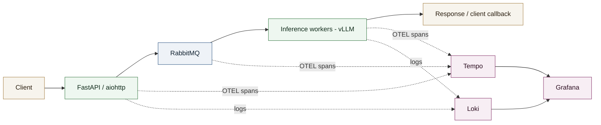
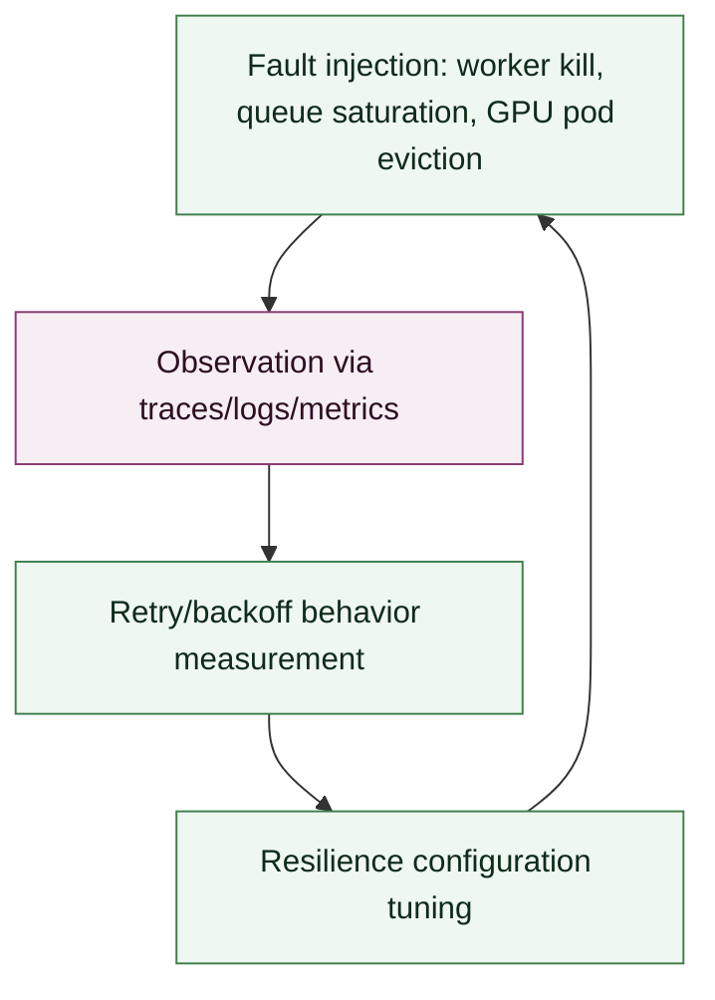

# Case Study - Reliability and Observability of an Asynchronous LLM Inference Pipeline

Hardening and full instrumentation of an asynchronous LLM inference pipeline, validated through chaos engineering campaigns, for a major French public financial administration.

## Context

**Role**: MLOps Engineer / LLM Inference Platform
**Client**: A major French public financial administration (delivered as a subcontractor)
**Period**: Since June 2026

Inference requests had to be processed asynchronously and resiliently, with end-to-end visibility over their path, from request ingestion to model response, without loss in case of a failure on any component of the chain.

## Technical approach

- **Async processing**: `FastAPI` / `aiohttp` workers to decouple request ingestion from inference execution, itself bound by GPU availability.
- **Message queue**: `RabbitMQ` as the backbone for job distribution, retries, and backpressure handling between the API layer and the inference workers.
- **Distributed tracing**: `OpenTelemetry` instrumentation with `W3C TraceContext` propagation across the API, the message queue, and the inference workers, enabling end-to-end request tracing across async boundaries.
- **Observability stack**: `Grafana` for dashboards, `Loki` for centralized log aggregation, `Tempo` for trace storage and visualization, correlated via the trace ID.
- **Chaos engineering**: controlled fault injection (worker kill, queue saturation, GPU pod eviction) to validate retry/backoff logic and measure real recovery behavior.

## My role

Designed the async architecture, instrumented OpenTelemetry end-to-end, built the Grafana/Loki/Tempo dashboards, ran the chaos engineering experiments, and hardened the pipeline based on the observed results.

## System diagram

## Chaos engineering

## Results

- **Inference request success rate**: [X]% under nominal load, [Y]% under chaos engineering conditions.
- **Incident detection time**: reduced to [N] minutes thanks to trace/log/metric correlation.
- **Recovery time (MTTR)** after a simulated incident: [M] minutes.
- End-to-end traceability coverage on [Z]% of asynchronous requests.
