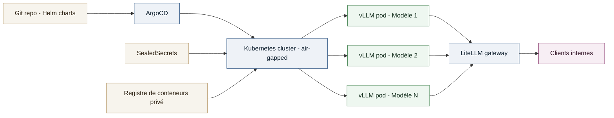

# Étude de cas - Plateforme d'inférence LLM souveraine multi-modèles sur Kubernetes

Plateforme de service de grands modèles de langage, multi-modèles, opérée en environnement souverain et air-gapped, pour le compte d'une grande administration financière française.

## Context

**Role**: Ingénieur MLOps / Plateforme d'inférence LLM
**Client**: Une grande administration financière française (mission réalisée en sous-traitance)
**Période**: Depuis avril 2026

Objectif de la mission : construire une plateforme d'inférence LLM entièrement souveraine, sans aucune dépendance à un fournisseur cloud ou une API externe, capable de servir plusieurs modèles open-weight simultanément à des équipes internes, dans un environnement contraint (air-gapped, registre de conteneurs privé, mirroring des dépendances).

## Technical approach

- **Serving**: `vLLM` comme moteur d'inférence, un déploiement dédié par modèle sur les nœuds GPU, exposant une API compatible OpenAI.
- **Gateway / routing**: `LiteLLM` en tant que proxy unifié devant les différentes instances vLLM, gérant le routage multi-modèles, le fallback, le rate limiting et le suivi d'usage.
- **Livraison GitOps**: charts `Helm` pour chaque composant (vLLM, LiteLLM, services support), appliqués via `ArgoCD` pour une livraison continue, traçable et compatible air-gapped.
- **Secrets**: `SealedSecrets` pour chiffrer les identifiants et clés directement dans Git, sans dépendance à un coffre-fort externe.
- **Contraintes de souveraineté**: hébergement 100% on-premise, registre de conteneurs privé, mirroring offline des charts et images, aucun appel sortant vers un service tiers.

## My role

Conception de l'architecture de bout en bout, du provisioning GPU jusqu'à l'exposition des API d'inférence. Écriture des charts Helm, mise en place de la chaîne GitOps ArgoCD, intégration de SealedSecrets pour la gestion des secrets, et exploitation en production dans un environnement contraint.

## System diagram

## Results

- **Nombre de modèles servis simultanément**: [N] modèles LLM open-weight en production.
- **Disponibilité**: [X]% de disponibilité sur la période.
- **Déploiement**: temps de mise en production d'un nouveau modèle réduit à [M] minutes via le pipeline GitOps.
- Souveraineté totale de la plateforme : aucune dépendance à un fournisseur cloud ou une API externe, conforme aux exigences de l'administration.
