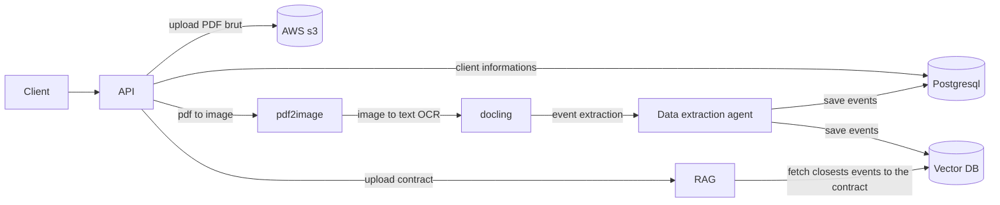
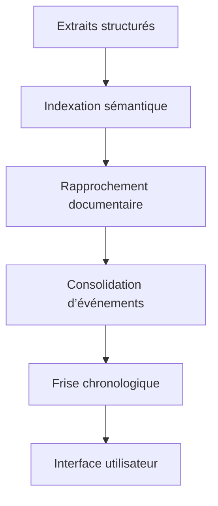

# Étude de cas — Pipeline OCR & Parsing documentaire juridique

## Tantar

**Tantar** est un outil de recherche **intra-documentaire** à destination des **juristes, avocats et cabinets d’expertise-comptable**.
Sa mission : transformer des documents juridiques complexes et hétérogènes en une **frise chronologique fiable, explicable et directement exploitable**, retraçant la vie juridique complète d’une société.

---

## Constat métier

Dans les pratiques juridiques, les **procès-verbaux d’Assemblées Générales (AG)** constituent la *golden source* :

* toutes les décisions structurantes y sont consignées,
* toutes les autorisations juridiques en découlent,
* l’ensemble des documents juridiques d’une société est lié, directement ou indirectement, à une décision d’AG.

Pourtant, ces documents sont :

* majoritairement fournis au format **PDF non structuré**,
* souvent **scannés** ou partiellement exploitables,
* difficiles à relier entre eux dans le temps sans relecture manuelle exhaustive.

👉 Résultat : des heures de lecture, un risque d’erreur élevé, et une vision fragmentée de l’historique juridique.

Tantar est né de ce constat : **lire automatiquement les PV d’AG, reconstituer la chronologie juridique d’une société, puis rattacher intelligemment les pièces associées**.

---

## Contexte

* **Rôle** : Cofondateur & Lead Produit / Tech
* **Période** : 2023 – présent
* **Objectif produit** :
  Extraire des informations juridiques clés depuis des documents PDF, structurer des événements fiables, et restituer une **timeline vérifiable** pour des équipes juridiques exigeantes.

---

## Enjeux et contraintes

* Corpus de **milliers de documents par société**, représentant en moyenne **[10 000 à 100 00] pages**.
* Documents couvrant une période de **[1 à 50] années** d’historique juridique.
* Exigence forte d’**explicabilité** : chaque information doit être traçable à une source précise (document, page, paragraphe).
* Taux d’erreur acceptable proche de **[95%]**, compte tenu des enjeux juridiques.
* Besoin de scalabilité : traitement de **milliers de dossiers par jour**.

---

## Approche technique

### 1. Parsing documentaire robuste

* OCR **page par page** pour gérer les PDF scannés et hybrides.
* Reconstruction logique du document (titres, sections, hiérarchie).
* Classification automatique par type de document (PV d’AG, statuts, résolutions, annexes…).

📊 **Volumes traités** :

* **[50 000 à 100 000] pages OCRisées**
* Temps moyen OCR : **1 seconde / page**

---

### 2. Extraction structurée orientée métier

* Extraction LLM guidée par **schémas juridiques typés**.
* Production d’objets structurés :

  * dates d’AG,
  * décisions et résolutions,
  * organes de décision,
  * références légales,
  * documents associés.

📊 **Qualité d’extraction** :

* Taux de complétude des champs critiques : **[80–90 %]**
* Taux de validation humaine sans correction : **[95 %]**

---

### 3. RAG & frise chronologique

* Indexation sémantique des extraits structurés et des documents sources.
* Rapprochement automatique des pièces liées à un même événement juridique.
* Consolidation d’événements multi-sources pour produire une **frise chronologique unique**.

📊 **Impact utilisateur** :

* Temps de reconstitution manuelle avant Tantar : **[50 à 100] heures / dossier**
* Temps avec Tantar : **[10 à 20] minutes**
* Gain de temps estimé : **[80-90 %]**

---

## Mon rôle

* Conception de l’architecture produit et technique.
* Définition du pipeline asynchrone OCR → structure → classification → extraction → indexation.
* Implémentation et orchestration des workers (OCR, LLM, RAG).
* Mise en place des mécanismes de traçabilité et de contrôle qualité.
* Supervision de la restitution des événements sous forme de frise chronologique.
* Participation à des salons **LegalTech** pour la promotion de la solution.
* Démarchage clients, démonstrations live auprès de **[XX] bêta-testeurs**.
* Accompagnement des utilisateurs dans leurs premiers cas d’usage.

---

## Pipeline OCR & Parsing documentaire

---

## RAG & génération de la frise chronologique

---

## Stack technique

* **API** : FastAPI
* **Pipeline & orchestration** : RabbitMQ, Kubernetes
* **OCR & parsing** : Docling, docling-hierarchical-pdf, AWS Textract
* **Stockage** : S3 / MinIO, PostgreSQL
* **LLM** : classification & extraction (Pydantic-AI, LangChain)
* **RAG** : indexation sémantique et rapprochement documentaire (LanceDB)

---

## Résultats

* Pipeline **scalable et résilient**, capable de traiter **plusieurs milliers de pages / mois**.
* Chaîne complète du PDF brut à une **frise chronologique juridiquement exploitable**.
* Réduction du temps de lecture et de synthèse de **[80–90 %]**.
* Amélioration mesurable de la fiabilité et de la traçabilité des informations juridiques.

---

## Perspectives

* Ajout d’un **score de confiance par événement**.
* Boucle de feedback utilisateur pour améliorer les schémas d’extraction.
* Intégration d’un **contrôle humain assisté** pour les cas juridiques complexes.
* Extension à d’autres typologies documentaires (fusions, opérations capitalistiques, restructurations).
