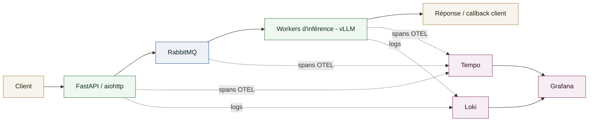
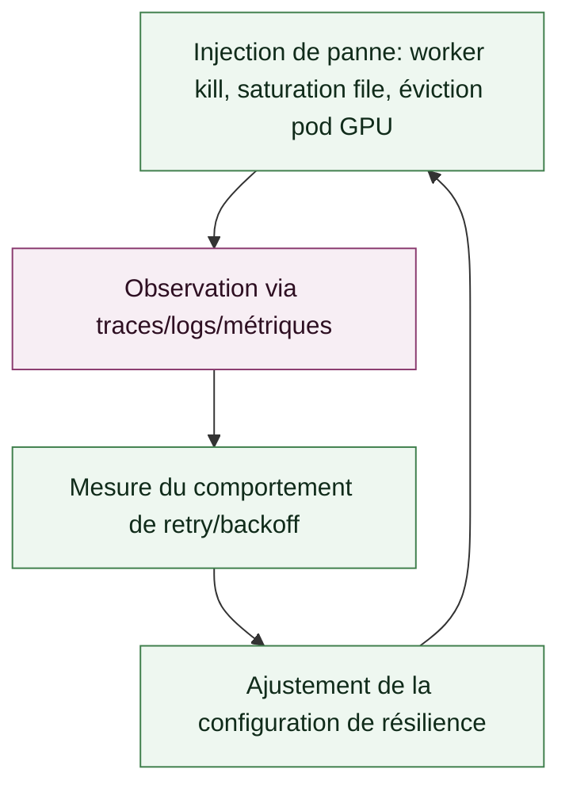

# Étude de cas - Fiabilité et observabilité d'un pipeline d'inférence LLM asynchrone

Fiabilisation et instrumentation complète d'un pipeline d'inférence LLM asynchrone, validées par des campagnes de chaos engineering, pour une grande administration financière française.

## Context

**Role**: Ingénieur MLOps / Plateforme d'inférence LLM
**Client**: Une grande administration financière française (mission réalisée en sous-traitance)
**Période**: Depuis juin 2026

Les requêtes d'inférence devaient être traitées de manière asynchrone et résiliente, avec une visibilité de bout en bout sur leur cheminement, de la réception de la requête jusqu'à la réponse du modèle, sans perte en cas d'incident sur un composant de la chaîne.

## Technical approach

- **Traitement asynchrone**: workers `FastAPI` / `aiohttp` pour découpler la réception des requêtes de l'exécution de l'inférence, elle-même bornée par la disponibilité GPU.
- **File de messages**: `RabbitMQ` comme colonne vertébrale de distribution des tâches, gestion des retries et du backpressure entre la couche API et les workers d'inférence.
- **Tracing distribué**: instrumentation `OpenTelemetry` avec propagation du contexte `W3C TraceContext` à travers l'API, la file de messages et les workers d'inférence, permettant de suivre une requête de bout en bout à travers les frontières asynchrones.
- **Stack d'observabilité**: `Grafana` pour les dashboards, `Loki` pour l'agrégation centralisée des logs, `Tempo` pour le stockage et la visualisation des traces, corrélés via l'identifiant de trace.
- **Chaos engineering**: injection de pannes contrôlées (arrêt de worker, saturation de la file, éviction de pod GPU) pour valider la logique de retry/backoff et mesurer le comportement réel de récupération.

## My role

Conception de l'architecture asynchrone, instrumentation OpenTelemetry de bout en bout, construction des dashboards Grafana/Loki/Tempo, conduite des expériences de chaos engineering et fiabilisation du pipeline à partir des résultats observés.

## System diagram

## Chaos engineering

## Results

- **Taux de succès des requêtes d'inférence**: [X]% en charge nominale, [Y]% en conditions de chaos engineering.
- **Temps de détection d'incident**: réduit à [N] minutes grâce à la corrélation traces/logs/métriques.
- **Temps de récupération (MTTR)** après incident simulé: [M] minutes.
- Couverture de traçabilité de bout en bout sur [Z]% des requêtes asynchrones.
