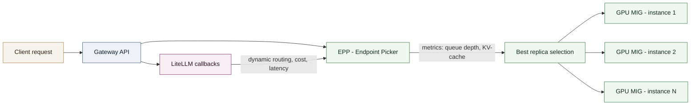

# Case Study - GPU Scheduling and LLM Inference Load Balancing Optimization

Optimization of GPU utilization and inference request routing on a multi-model LLM platform, for a major French public financial administration.

## Context

**Role**: MLOps Engineer / LLM Inference Platform
**Client**: A major French public financial administration (delivered as a subcontractor)
**Period**: Since June 2026

On top of the already-production sovereign LLM inference platform, the goal was to increase the number of models hosted per GPU and route requests to the most appropriate replica based on its actual load, instead of generic round-robin balancing.

## Technical approach

- **GPU partitioning**: `NVIDIA MIG` (Multi-Instance GPU) to slice physical GPUs into isolated instances, letting several smaller models share a GPU without contention.
- **Inference-aware load balancing**: Kubernetes `Gateway API Inference Extension` (EPP - Endpoint Picker) to route each request to the most relevant replica based on inference-specific signals (queue depth, KV-cache occupancy) rather than generic HTTP load balancing.
- **Custom routing logic**: `LiteLLM` callbacks hooking into the request/response lifecycle, enabling dynamic routing and cost/latency-aware model selection.
- **Continuous tuning** of MIG profiles based on observed per-model memory footprint and throughput.

## My role

Designed and implemented the GPU partitioning strategy, integrated the EPP into the inference gateway, and developed the LiteLLM callback logic for dynamic routing.

## System diagram

## Results

- **GPU utilization rate**: increased from [X]% to [Y]% through MIG partitioning.
- **P99 latency**: reduced by [N]% thanks to inference-aware routing.
- **Models per GPU density**: [M] models co-hosted per physical GPU.
- Fewer overload errors (OOM, throttling) thanks to routing based on actual load instead of generic round-robin.
