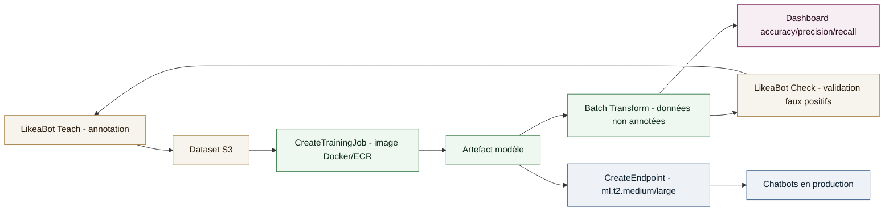
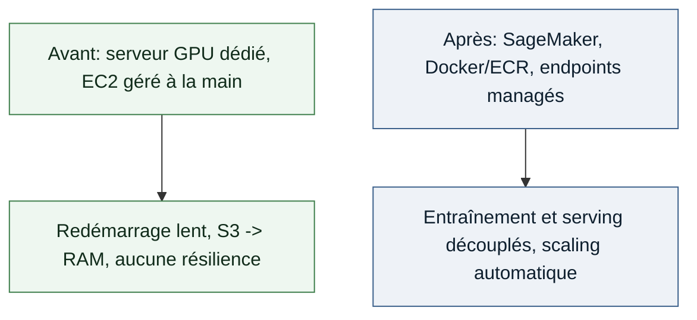

# Étude de cas - Pipeline d'hébergement et de mise à jour de modèles NLP à l'échelle (Like a Bot / AWS SageMaker)

Refonte de l'hébergement des modèles NLP d'une plateforme de chatbots pour la rendre scalable, résiliente et industrialisable, en remplaçant un hébergement rigide sur serveur GPU dédié par une architecture de model serving managée.

## Contexte

**Poste**: Data Scientist Junior, Like a Bot (ex Like A Bird)
**Période**: 2018-2022

La plateforme Chatbot Builder de Like a Bot devait servir des modèles NLP/NLU à des centaines de chatbots en simultané pour des milliers d'utilisateurs. L'hébergement initial - entraînement local sur un serveur GPU et modèles servis depuis des instances EC2 gérées à la main - ne tenait plus la charge : temps de redémarrage critique (téléchargement du modèle depuis S3 puis rechargement en RAM), aucune résilience en cas de défaillance, et un cycle d'entraînement local difficile à transférer en production.

## Approche technique

- **Containerisation du hosting**: chaque modèle packagé dans une image Docker structurée (`Dockerfile`, script `train`, script `serve`), poussée sur Amazon ECR pour versioning et import direct dans SageMaker.
- **Pipeline d'hébergement en 6 étapes**: annotation (LikeaBot Teach) → entraînement via `CreateTrainingJob` sur les datasets S3 → prédictions batch via `Batch Transform` sur données non annotées → validation humaine des faux positifs (LikeaBot Check) → évaluation (accuracy, precision, recall, matrice de confusion) → déploiement temps réel via `CreateEndpoint`.
- **Serving en microservices**: endpoints HTTP(S) managés par SageMaker, hébergés sur des instances légères (`ml.t2.medium`, `ml.t2.large`), découplés des instances GPU utilisées uniquement pour l'entraînement.
- **Multi-framework**: la même chaîne d'hébergement supportait plusieurs architectures de modèles (BERT, GPT, LSTM, ResNet) sans changer l'infrastructure de serving.
- **Boucle d'amélioration continue outillée**: suggestions d'annotation automatiques (Chatbot Master) pour réduire l'effort humain et accélérer les cycles de mise à jour des modèles en production.

## Mon rôle

Conception de la stratégie de containerisation Docker/ECR, intégration du pipeline d'entraînement et de déploiement SageMaker (`CreateTrainingJob`, `Batch Transform`, `CreateEndpoint`), et co-rédaction avec les équipes AWS d'un retour d'expérience public sur cette migration d'hébergement.

## Schéma système

## Avant / après

## Résultats

- **Temps de mise au point d'un modèle**: réduit de 8 semaines à 2 semaines (divisé par 4).
- **Coûts**: instances puissantes utilisées uniquement pendant l'entraînement/l'évaluation (tâches éphémères), coût d'hébergement des endpoints comparable à des instances EC2 équivalentes, baisse des coûts d'infrastructure globaux par rapport à l'architecture initiale.
- **Résilience**: fin des interruptions liées aux redémarrages manuels grâce à des endpoints managés et à la séparation entraînement/serving.
- **Retour d'expérience publié avec les équipes AWS**: [Améliorer les performances d'une plateforme de chatbot grâce à Amazon SageMaker](https://aws.amazon.com/fr/blogs/france/ameliorer-les-performances-dune-plateforme-de-chatbot-grace-a-amazon-sagemaker/).
