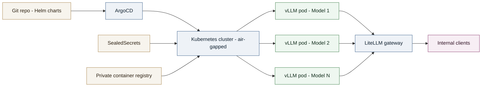

# Case Study - Sovereign Multi-Model LLM Inference Platform on Kubernetes

Multi-model large language model serving platform, operated in a sovereign, air-gapped environment for a major French public financial administration.

## Context

**Role**: MLOps Engineer / LLM Inference Platform
**Client**: A major French public financial administration (delivered as a subcontractor)
**Period**: Since April 2026

Mission objective: build a fully sovereign LLM inference platform with no dependency on any external cloud provider or API, able to serve several open-weight models simultaneously to internal teams, within a constrained environment (air-gapped, private container registry, offline-mirrored dependencies).

## Technical approach

- **Serving**: `vLLM` as the inference engine, one dedicated deployment per model on GPU nodes, exposing an OpenAI-compatible API.
- **Gateway / routing**: `LiteLLM` as a unified proxy in front of the vLLM instances, handling multi-model routing, fallback, rate limiting, and usage tracking.
- **GitOps delivery**: `Helm` charts for every component (vLLM, LiteLLM, supporting services), applied through `ArgoCD` for continuous, auditable, air-gap-compatible delivery.
- **Secrets**: `SealedSecrets` to encrypt credentials and API keys directly in Git, without relying on an external vault.
- **Sovereignty constraints**: fully on-premise hosting, private container registry, offline mirroring of charts and images, no outbound calls to any third-party service.

## My role

Designed the end-to-end architecture, from GPU provisioning to exposing inference APIs. Wrote the Helm charts, set up the ArgoCD GitOps pipeline, integrated SealedSecrets for secret management, and operated the platform in production within a constrained environment.

## System diagram

## Results

- **Concurrent models served**: [N] open-weight LLMs in production.
- **Availability**: [X]% uptime over the period.
- **Deployment**: new model rollout time reduced to [M] minutes through the GitOps pipeline.
- Full platform sovereignty: no dependency on any external cloud provider or API, meeting the administration's requirements.
