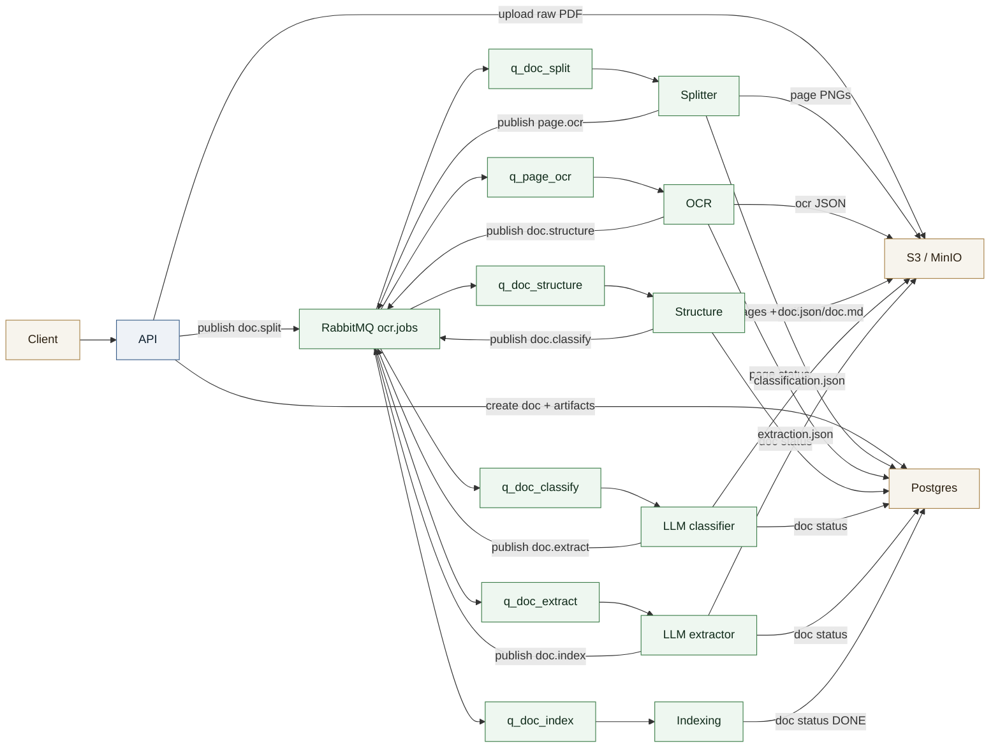
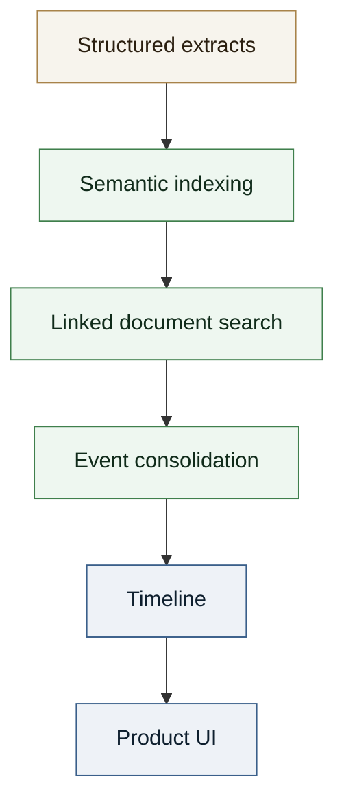

# Case Study - OCR + Document Parsing Pipeline (Tantar)

Production OCR and parsing pipeline on Kubernetes, orchestrated by RabbitMQ, with S3 and Postgres storage. The flow includes Docling, docling-hierarchical-pdf, and an LLM layer for classification/extraction, plus a RAG dimension to link documents and build a timeline.

## Context

**Role**: Co-founder and Lead Product/Tech, Tantar  
**Period**: 2023 - present  

Goal: extract key legal information from documents (PDF), structure events, and deliver a reliable timeline for legal teams.

## Technical approach

- **Async pipeline**: decoupled workers, autoscaled by queue length (KEDA).
- **Robust parsing**: per-page OCR, logical reconstruction, and LLM classification by document type.
- **Structured extraction**: LLM extraction guided by schemas per document type.
- **RAG and timeline**: semantic indexing to link documents, then generation of a structured timeline.
- **Reliability**: idempotency, bounded retries, DLQ, statuses persisted in the DB.

## My role

Designed the architecture, defined the pipeline, integrated OCR/structure/classification/extraction workers, and oversaw extraction quality and timeline delivery.

## Pipeline diagram (OCR + Parsing)

## RAG + timeline diagram

## Technical stack

- **API**: FastAPI, Python.
- **Pipeline**: RabbitMQ, KEDA, Kubernetes.
- **OCR and parsing**: Tesseract, Docling, docling-hierarchical-pdf.
- **Storage**: S3 / MinIO, Postgres.
- **LLM**: classification and extraction.
- **RAG**: semantic indexing and document linking.

## Results

- Stable, scalable, and traceable pipeline for sensitive legal documents.
- Full chain from raw PDF to an actionable timeline.
- Reduced reading and synthesis time for legal teams.
