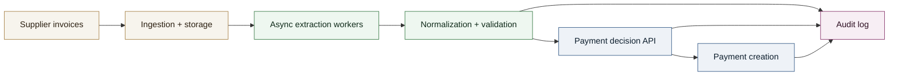
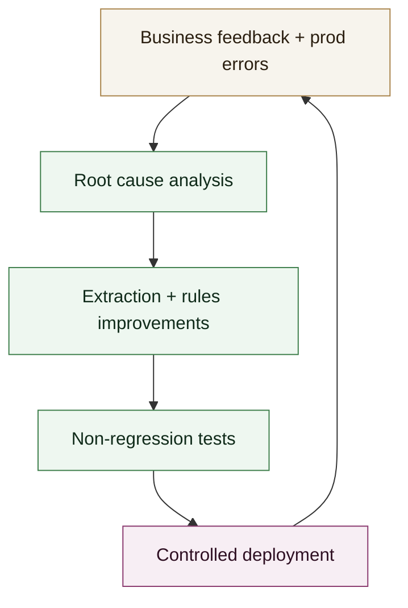

# Case Study - Payment Automation Platform (iBanFirst)

Distributed document analysis and automatic payment creation platform, designed for reliability, traceability, and scalability.

## Context

**Role**: Lead Backend and GenAI, iBanFirst  
**Period**: 2024 - present  

Goal: automate invoice data extraction and payment creation while meeting strong requirements for quality, compliance, and security.

## Technical approach

- **Document pipeline**: ingestion, extraction, normalization, and validation of critical fields.
- **Orchestration**: distributed architecture with asynchronous workers to handle high volumes.
- **API**: clear endpoints to trigger analysis, retrieve results, and drive payment creation.
- **Observability**: latency, error rate, and anomaly tracking to ensure production stability.
- **Security and compliance**: full traceability of decisions and model versions.

## Technical stack

- **Backend**: FastAPI, Pydantic, Python, asyncio.
- **Eventing**: Kafka.
- **Storage**: AWS S3.
- **Infra**: Docker.
- **Observability**: Grafana, Prometheus, OpenTelemetry.

## My role

Designed the distributed architecture, built a worker capable of parsing thousands of documents, implemented the automatic payment creation module, and supervised overall production quality.

## System diagram (Ingestion + Extraction + Payment)

## Quality loop

## Results

- **Latency**: < 1 second per file.
- **Error rate**: < 1%.
- Significant reduction in payment processing time.
- Fewer human errors through reliable automation.
- Stronger stability thanks to end-to-end observability and traceability.
