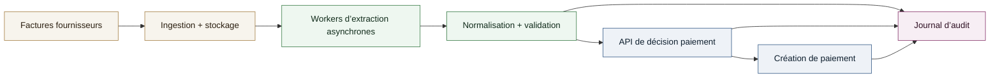
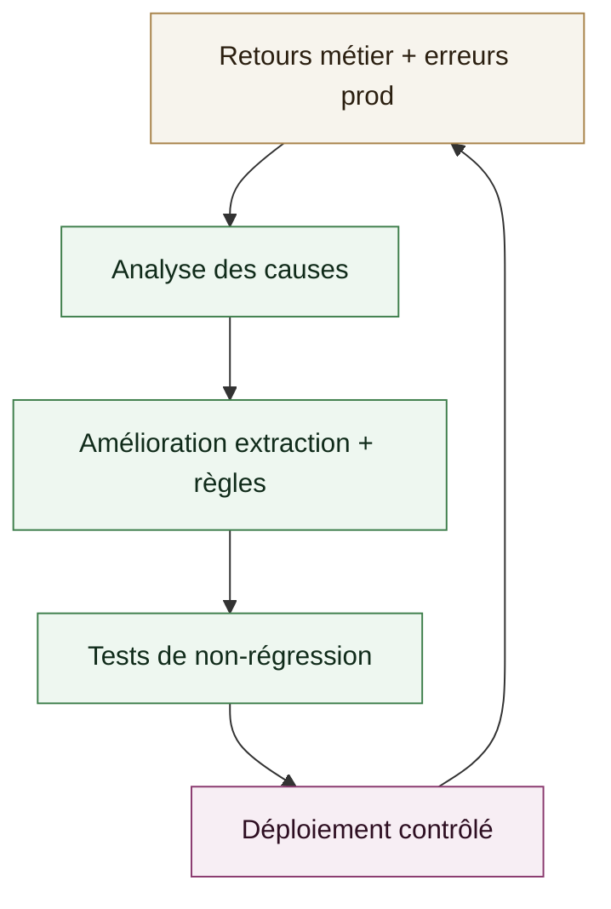

# Étude de cas - Plateforme d’automatisation des paiements (iBanFirst)

Plateforme distribuée d’analyse documentaire et de création automatique de paiements, conçue pour la fiabilité, la traçabilité et la scalabilité.

## Contexte

**Poste**: Lead Backend & GenAI, iBanFirst  
**Période**: 2024 - présent  

Objectif: automatiser l’extraction des données de factures et la création de paiements, tout en respectant des contraintes fortes de qualité, de conformité et de sécurité.

## Approche technique

- **Pipeline documentaire**: ingestion, extraction, normalisation et validation des champs critiques.
- **Orchestration**: architecture distribuée avec workers asynchrones pour traiter des volumes élevés.
- **API**: endpoints clairs pour déclencher l’analyse, récupérer les résultats et piloter la création des paiements.
- **Observabilité**: suivi de la latence, du taux d’erreur et des anomalies pour garantir la stabilité en prod.
- **Sécurité & conformité**: traçabilité complète des décisions et versions de modèles.

## Stack technique

- **Backend**: FastAPI, Pydantic, Python, asyncio.
- **Eventing**: Kafka.
- **Stockage**: AWS S3.
- **Infra**: Docker.
- **Observabilité**: Grafana, Prometheus, OpenTelemetry.

## Mon rôle

Conception de l’architecture distribuée, développement d’un worker capable de parser des milliers de documents, mise en place du module de création automatique des paiements, et supervision de la qualité globale en production.

## Schéma système (Ingestion + Extraction + Paiement)

## Boucle de qualité

## Résultats

- **Latence**: < 1 seconde par fichier.
- **Taux d’erreur**: < 1%.
- Réduction significative du temps de traitement des paiements.
- Diminution des erreurs humaines via une automatisation fiable.
- Stabilité renforcée grâce à une observabilité et une traçabilité end-to-end.

