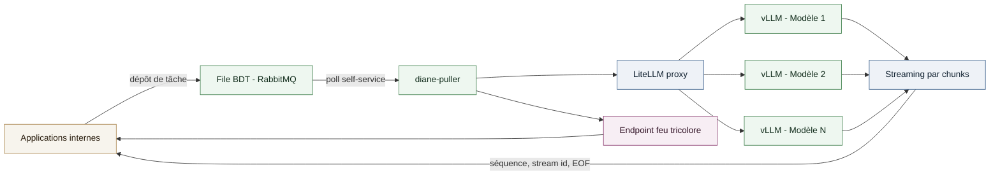
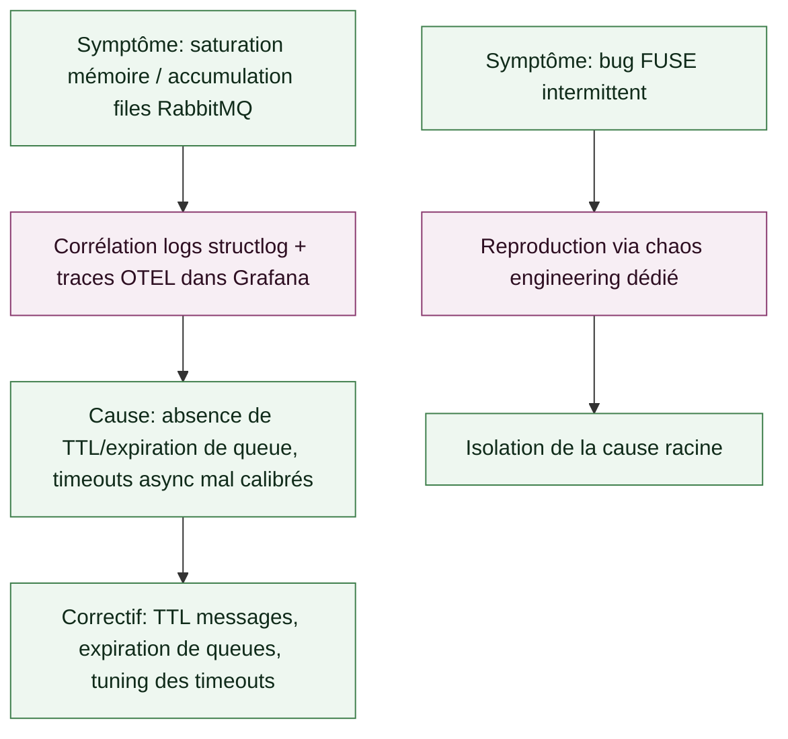

# Étude de cas — Pipeline d'inférence LLM asynchrone en self-service

Conception d'un microservice de récupération de tâches en self-service pour découpler les applications internes des pods d'inférence LLM, avec streaming des réponses et supervision de disponibilité en temps réel.

## Context

**Role**: Ingénieur MLOps / Plateforme d'inférence LLM
**Client**: Une grande administration financière française (mission réalisée en sous-traitance, via INOP'S/UGAP)
**Période**: Depuis juin 2026

Les applications internes devaient consommer plusieurs LLM sans appeler directement les pods d'inférence, et sans dépendre d'un cloud externe (contrainte RGPD et souveraineté, environnement air-gapped). Il fallait un intermédiaire capable de récupérer les tâches à traiter depuis une file, de les router vers le bon modèle, de streamer les réponses, et d'exposer en permanence l'état de disponibilité du service — le tout traçable et résilient en production.

## Approche technique

- **`diane-puller`**: microservice Python asynchrone qui poll une file de tâches (BDT) et récupère les demandes d'inférence en self-service, plutôt qu'un push depuis les applications.
- **Routage multi-modèles**: dispatch vers `vLLM` via un proxy `LiteLLM`, unifiant l'accès à plusieurs modèles derrière une seule interface.
- **Streaming**: restitution des réponses par chunks (numéros de séquence, identifiants de flux, sentinelles EOF) pour une consommation progressive côté application.
- **Disponibilité**: endpoint de disponibilité « feu tricolore » donnant en un coup d'œil l'état du service aux applications consommatrices.

## Fiabilité & observabilité

- **Traçabilité de bout en bout**: logs JSON structurés (`structlog`), propagation `OpenTelemetry` (`W3C TraceContext`) à travers les en-têtes AMQP, corrélation logs ↔ traces dans Grafana (`Loki`/`Tempo`/`Prometheus`).
- **Résolution de problèmes de production**: saturation mémoire et accumulation de files `RabbitMQ` (TTL messages, expiration de queues, timeouts async), et reproduction d'un bug FUSE via un setup de chaos engineering dédié pour isoler la cause racine.

## Mon rôle

Conception et développement de `diane-puller`, intégration du routage `vLLM`/`LiteLLM`, mise en place du streaming par chunks et de l'endpoint de disponibilité, instrumentation `OpenTelemetry`/`structlog` de bout en bout, et diagnostic/résolution des incidents de production (saturation RabbitMQ, bug FUSE).

## System diagram

## Diagnostic d'incidents

## Technical stack

- **Async**: Python async, `FastAPI`, `aiohttp`.
- **Messaging**: `RabbitMQ` (`aio_pika`).
- **Inférence**: `vLLM`, `LiteLLM`.
- **Observabilité**: `OpenTelemetry`, `structlog`, `Grafana` / `Loki` / `Tempo` / `Prometheus`.

## Results

- Pipeline d'inférence traçable requête par requête, résilient sous charge réelle, et exploitable en self-service par les applications internes.
- Diagnostic d'incidents fondé sur la corrélation logs/traces plutôt qu'en aveugle, avec résolution effective des problèmes de saturation RabbitMQ et du bug FUSE.
- **Volume de requêtes traitées en self-service**: [X] requêtes/jour.
- **Disponibilité du service (endpoint feu tricolore)**: [Y]%.
- **Temps de résolution d'incident**: réduit à [N] grâce à la corrélation logs/traces.
