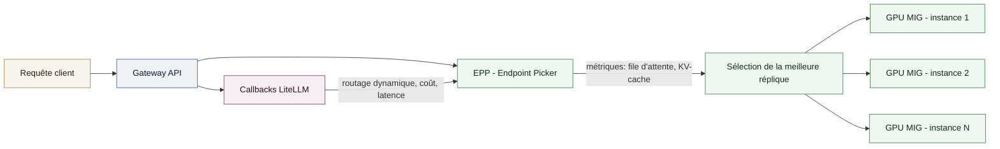

# Étude de cas - Optimisation du scheduling GPU et du load balancing d'inférence LLM

Optimisation de l'utilisation des GPU et du routage des requêtes d'inférence sur une plateforme LLM multi-modèles, pour une grande administration financière française.

## Context

**Role**: Ingénieur MLOps / Plateforme d'inférence LLM
**Client**: Une grande administration financière française (mission réalisée en sous-traitance)
**Période**: Depuis juin 2026

Sur la plateforme d'inférence LLM souveraine déjà en production, l'enjeu était d'augmenter la densité de modèles par GPU et de router les requêtes vers la réplique la plus adaptée en fonction de sa charge réelle, plutôt qu'un équilibrage générique de type round-robin.

## Technical approach

- **Partitionnement GPU**: `NVIDIA MIG` (Multi-Instance GPU) pour découper les GPU physiques en instances isolées, permettant à plusieurs modèles de taille modeste de partager un même GPU sans contention.
- **Load balancing conscient de l'inférence**: `Gateway API Inference Extension` (EPP - Endpoint Picker) pour router chaque requête vers la réplique la plus pertinente en s'appuyant sur des signaux propres à l'inférence (profondeur de file, occupation du KV-cache) plutôt que sur un équilibrage HTTP générique.
- **Logique de routage custom**: callbacks `LiteLLM` pour intervenir dans le cycle de vie des requêtes/réponses, permettant un routage dynamique et une sélection de modèle basée sur le coût et la latence.
- **Ajustement continu** des profils MIG en fonction de l'empreinte mémoire et du débit observés par modèle.

## My role

Conception et mise en œuvre de la stratégie de partitionnement GPU, intégration de l'EPP dans la gateway d'inférence, et développement de la logique de callbacks LiteLLM pour le routage dynamique.

## System diagram

## Results

- **Taux d'utilisation GPU**: passé de [X]% à [Y]% grâce au partitionnement MIG.
- **Latence P99**: réduite de [N]% grâce au routage conscient de la charge d'inférence.
- **Densité de modèles par GPU**: [M] modèles co-hébergés par GPU physique.
- Réduction des erreurs de surcharge (OOM, throttling) grâce à un routage basé sur la charge réelle plutôt qu'un round-robin générique.
