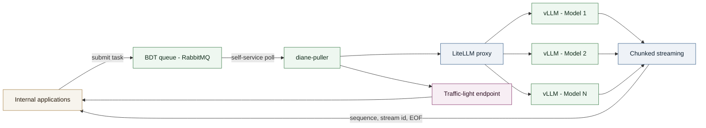
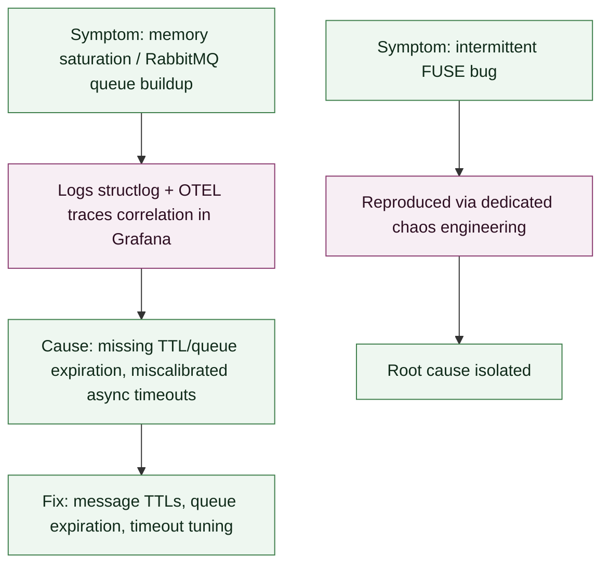

# Case Study — Self-Service Asynchronous LLM Inference Pipeline

Designed a self-service task-pulling microservice to decouple internal applications from LLM inference pods, with response streaming and real-time availability monitoring.

## Context

**Role**: MLOps Engineer / LLM Inference Platform
**Client**: A major French public financial administration (delivered as a subcontractor, via INOP'S/UGAP)
**Period**: Since June 2026

Internal applications needed to consume multiple LLMs without calling the inference pods directly, and without depending on an external cloud (GDPR and sovereignty constraints, air-gapped environment). This required an intermediary able to pull pending tasks from a queue, route them to the right model, stream back the responses, and continuously expose the service's availability status — all traceable and resilient in production.

## Technical approach

- **`diane-puller`**: an asynchronous Python microservice that polls a task queue (BDT) and pulls inference requests self-service, rather than applications pushing to it.
- **Multi-model routing**: dispatch to `vLLM` through a `LiteLLM` proxy, unifying access to several models behind a single interface.
- **Streaming**: responses returned in chunks (sequence numbers, stream identifiers, EOF sentinels) for progressive consumption on the application side.
- **Availability**: a "traffic light" availability endpoint giving consuming applications an at-a-glance view of service health.

## Reliability & observability

- **End-to-end traceability**: structured JSON logs (`structlog`), `OpenTelemetry` propagation (`W3C TraceContext`) through AMQP headers, logs ↔ traces correlation in Grafana (`Loki`/`Tempo`/`Prometheus`).
- **Production incident resolution**: memory saturation and `RabbitMQ` queue buildup (message TTLs, queue expiration, async timeouts), and reproduction of an intermittent FUSE bug through a dedicated chaos engineering setup to isolate the root cause.

## My role

Designed and built `diane-puller`, integrated `vLLM`/`LiteLLM` routing, implemented chunked streaming and the availability endpoint, instrumented the service end-to-end with `OpenTelemetry`/`structlog`, and diagnosed/resolved production incidents (RabbitMQ saturation, FUSE bug).

## System diagram

## Incident diagnosis

## Technical stack

- **Async**: Python async, `FastAPI`, `aiohttp`.
- **Messaging**: `RabbitMQ` (`aio_pika`).
- **Inference**: `vLLM`, `LiteLLM`.
- **Observability**: `OpenTelemetry`, `structlog`, `Grafana` / `Loki` / `Tempo` / `Prometheus`.

## Results

- Request-by-request traceable inference pipeline, resilient under real load, and usable self-service by internal applications.
- Incident diagnosis grounded in logs/traces correlation rather than guesswork, with actual resolution of RabbitMQ saturation issues and the FUSE bug.
- **Self-service request volume**: [X] requests/day.
- **Service availability (traffic-light endpoint)**: [Y]%.
- **Incident resolution time**: reduced to [N] thanks to logs/traces correlation.
