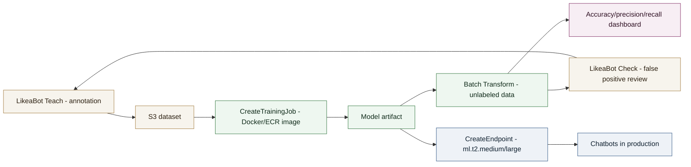
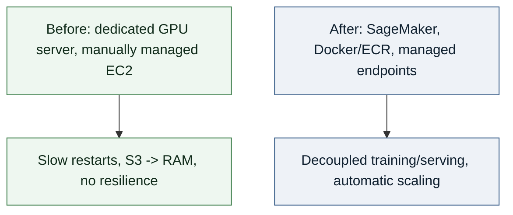

# Case Study - Scalable NLP Model Hosting & Update Pipeline (Like a Bot / AWS SageMaker)

Redesigned the model hosting layer of a chatbot platform to make it scalable, resilient, and industrializable, replacing a rigid dedicated-GPU-server setup with a managed model-serving architecture.

## Context

**Role**: Junior Data Scientist, Like a Bot (formerly Like A Bird)
**Period**: 2018-2022

Like a Bot's Chatbot Builder platform had to serve NLP/NLU models to hundreds of chatbots simultaneously for thousands of users. The original hosting setup - local training on a GPU server, models served from manually managed EC2 instances - could no longer handle the load: critical restart times (downloading the model from S3 then reloading it into RAM), no resilience on failure, and a local training cycle that was hard to transfer into production.

## Technical approach

- **Containerized hosting**: each model packaged as a Docker image (`Dockerfile`, `train` script, `serve` script), pushed to Amazon ECR for versioning and direct import into SageMaker.
- **6-step hosting pipeline**: annotation (LikeaBot Teach) → training via `CreateTrainingJob` on S3 datasets → batch predictions via `Batch Transform` on unlabeled data → human validation of false positives (LikeaBot Check) → evaluation (accuracy, precision, recall, confusion matrix) → real-time deployment via `CreateEndpoint`.
- **Microservices serving**: HTTP(S) endpoints managed by SageMaker, hosted on lightweight instances (`ml.t2.medium`, `ml.t2.large`), decoupled from the GPU instances used only for training.
- **Multi-framework**: the same hosting chain supported several model architectures (BERT, GPT, LSTM, ResNet) without changing the serving infrastructure.
- **Tooled continuous improvement loop**: automatic annotation suggestions (Chatbot Master) to cut human effort and speed up model update cycles in production.

## My role

Designed the Docker/ECR containerization strategy, integrated the SageMaker training and deployment pipeline (`CreateTrainingJob`, `Batch Transform`, `CreateEndpoint`), and co-authored a public experience report with AWS teams on this hosting migration.

## System diagram

## Before / after

## Results

- **Model tuning time**: reduced from 8 weeks to 2 weeks (4x faster).
- **Costs**: powerful instances used only for ephemeral training/evaluation jobs, endpoint hosting cost comparable to equivalent EC2 instances, overall infrastructure cost reduced versus the original architecture.
- **Resilience**: eliminated downtime from manual restarts thanks to managed endpoints and the training/serving split.
- **Experience report published with AWS**: [Improving chatbot platform performance with Amazon SageMaker](https://aws.amazon.com/fr/blogs/france/ameliorer-les-performances-dune-plateforme-de-chatbot-grace-a-amazon-sagemaker/) (French).
