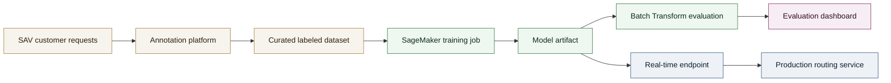
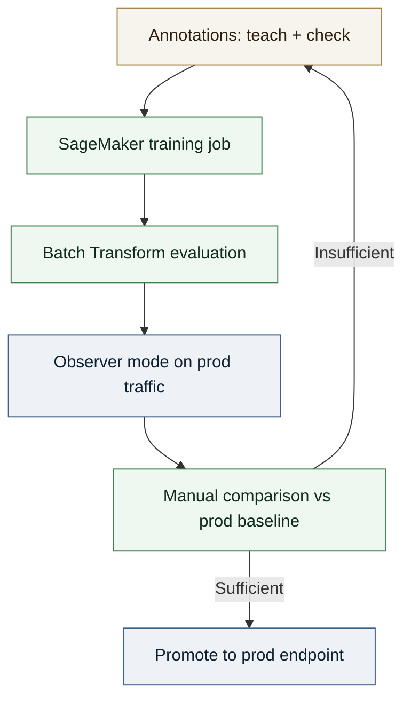

# Case Study - NLP Fine-Tuning for SAV Routing (AWS SageMaker)

Robust classification system to route after-sales (SAV) requests with a strict precision-first policy and a continuous improvement loop.

## Context

**Role**: Junior Data Scientist, Like A Bird  
**Period**: 2018-2022  

I designed a text classification system to route SAV (after-sales service) requests to the right team. The dataset included 10,000+ real requests, labeled through an internal annotation platform. Class imbalance was handled with noise augmentation and expert-written synthetic examples.

## Technical approach

- **Model**: `bert-base-uncased`, chosen for strong baseline performance and efficient fine-tuning.
- **Training**: SageMaker Training Jobs using a custom Docker image to ensure reproducibility.
- **Evaluation**: Accuracy, precision, and recall, with a strong preference for precision to avoid off-topic routing (Like A Bird philosophy: better to escalate to a human than misroute).
- **Deployment**: Batch Transform for off-prod evaluation and a managed Endpoint for real-time inference.
- **Monitoring**: Annotation platform surfacing predictions, with outlier prioritization to focus on uncertain cases.
- **Constraints**: Strict privacy requirements, no external SaaS services.

## My role

Led model development, training and inference pipelines, evaluation logic, SageMaker integration, Docker containerization, and backend services. Partnered with a Vue.js engineer for the annotation UI.

## System diagram (Training and inference)

## Improvement loop

## Results

- **Model quality**: Accuracy > 0.95, precision > 0.95, recall > 0.8.
- **Routing philosophy**: precision first to avoid errors; when uncertain, escalate to a human rather than misroute.
- Faster iterations on SAV routing models through an automated improvement loop.
- Controlled rollout via observer mode before real-time promotion.
- Reduced annotation effort over time by targeting outliers and uncertain predictions.
