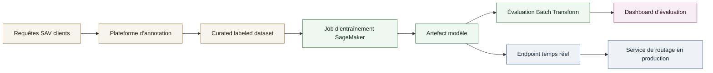
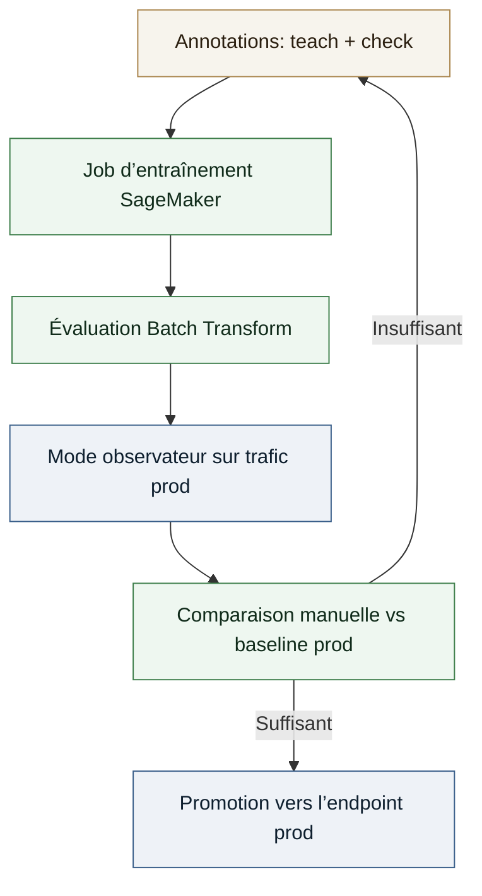

# Étude de cas - Fine-Tuning NLP pour le routage SAV (AWS SageMaker)

Système de classification robuste pour router des demandes SAV avec une priorité stricte à la precision et une boucle d’amélioration continue.

## Contexte

**Poste**: Data Scientist Junior, Like A Bird  
**Période**: 2018-2022  

J’ai conçu un système de classification de texte pour router les demandes SAV (service après-vente) vers le bon service. Le dataset comprenait 10 000+ requêtes réelles, annotées via une plateforme interne. Le déséquilibre des classes a été traité par augmentation de bruit et par des exemples synthétiques rédigés par des experts métier.

## Approche technique

- **Modèle**: `bert-base-uncased`, choisi pour ses performances de base solides et un fine-tuning efficace.
- **Entraînement**: SageMaker Training Jobs via une image Docker personnalisée pour garantir la reproductibilité.
- **Évaluation**: Accuracy, precision et recall, avec une préférence forte pour la precision afin d’éviter les routages hors sujet (philosophie Like A Bird: mieux vaut escalader à un humain que mal router).
- **Déploiement**: Batch Transform pour l’évaluation hors-prod et Endpoint managé pour l’inférence temps réel.
- **Monitoring**: Plateforme d’annotation exposant les prédictions, avec priorisation des outliers pour se concentrer sur les cas incertains.
- **Contraintes**: Exigences strictes de confidentialité, sans services SaaS externes.

## Mon rôle

Pilotage du développement modèle, des pipelines d’entraînement et d’inférence, de la logique d’évaluation, de l’intégration SageMaker, de la containerisation Docker et des services backend. Collaboration avec un ingénieur Vue.js pour l’interface d’annotation.

## Schéma système (Entraînement et inférence)

## Boucle d’amélioration

## Résultats

- **Qualité modèle**: Accuracy > 0.95, precision > 0.95, recall > 0.8.
- **Philosophie de routage**: priorité à la precision pour éviter les erreurs; en cas d’incertitude, escalade à un humain plutôt que mauvais routage.
- Itérations plus rapides sur les modèles de routage SAV grâce à une boucle d’amélioration automatisée.
- Déploiement contrôlé via un mode observateur avant promotion en temps réel.
- Effort d’annotation réduit dans le temps en ciblant les outliers et les prédictions incertaines.

Si tu veux, partage des métriques réelles (precision/recall, impact sur le routage) et je les intègre précisément.
