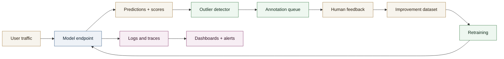

# Article - Model observability in production

Model observability is not a luxury: it is the condition for maintaining precision, trust, and compliance over time. In production, a model rarely degrades "all at once"; it drifts quietly because of data shifts, user behavior changes, or business constraints. This article provides a clear structure inspired by common practice, with a focus on surfacing outliers and continuous improvement.

## 1) Why ML observability is different

An ML service is not just an endpoint: it must explain model behavior, not only API availability. Core questions:

- Is the model still reliable on real data?
- Are performances degrading on specific segments?
- Are predictions explainable and auditable?
- Are critical errors detected before they impact users?

## 2) Signals to monitor (the baseline trio)

### A. System signals

- Latency, throughput, HTTP errors, timeouts.
- CPU/GPU saturation, memory, queue depth.
- Availability, errors by model version.

### B. Data signals

- Feature drift (distribution, categories, missing values).
- Train/serve skew (differences between training and production data).
- Input quality (length, language, schema, format).

### C. Performance signals

- Precision, recall, accuracy (when labels are available).
- Quality proxies (confidence score, entropy, calibration).
- Business impact (escalation rate, critical errors, costs).

## 3) Outliers: the operational source of truth

Outliers should be surfaced first because they represent:

- Rare cases with high learning value.
- Blind spots of the model.
- Operational risks (bad routing, critical false positives).

Common approach:

- Uncertainty scoring (entropy, margin, temperature scaling).
- Business heuristics (unusual length, rare categories, > n standard deviations).
- Prioritization in an annotation interface for human feedback.

## 4) Observability architecture pattern

## 5) Typical stack (concrete examples)

- **AWS SageMaker**: endpoints, inference logs, drift monitoring, data capture.
- **Prometheus**: collection of system and application metrics.
- **Grafana**: dashboards, alerting, segmentation by model/version.
- **Logfire**: application traces and logs with ML request correlation.
- **Storage**: S3 for data capture, Postgres/Parquet for analysis.
- **Orchestration**: daily/weekly monitoring jobs (batch).

## 6) Governance best practices

- **Versioning**: model, code, features, dataset, and configuration.
- **Traceability**: keep predictions and scores for a defined period.
- **A/B comparisons**: observe a model in shadow mode before promotion.
- **Auditability**: preserve decision context (input, output, version).
- **Business thresholds**: alerts must reflect real risk, not just statistical variance.

## 7) Mistakes to avoid

- Only tracking system metrics (latency/errors) and ignoring quality.
- Leaving outliers without human review.
- Monitoring only global metrics and missing regressions by segment.
- Noisy alerts that fatigue teams and hide real incidents.

## 8) Pragmatic rollout (simple roadmap)

1. Minimal capture: inputs, outputs, scores + system metrics.
2. Clear dashboards: latency, errors, basic drift.
3. Outlier loop: selection + annotation + retraining.
4. Version comparisons: shadow mode.
5. Extend to critical business segments.

## 9) Conclusion

Strong ML observability is more than dashboards. It organizes production around a feedback loop on risky cases. That mechanism, more than any single metric, keeps systems robust over time.
