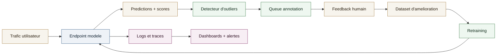

# Article - Observabilite des modeles en production

L'observabilite des modeles n'est pas un luxe: c'est la condition pour maintenir la precision, la confiance et la conformite sur la duree. En production, un modele degrade rarement "d'un coup"; il glisse, silencieusement, a cause de changements de donnees, de comportements utilisateurs, ou de contraintes business. Cet article propose une structure claire, inspiree des pratiques les plus frequentes que j'ai pu recontrer dans mes differents projets, avec un focus sur la remontée des outliers et l'amelioration continue.

## 1) Pourquoi l'observabilite ML est differente

Un service ML n'est pas un simple endpoint: il doit rendre compte du comportement du modele, pas seulement de la disponibilite de l'API. Les questions centrales:

- Le modele reste-t-il fiable sur les donnees reelles?
- Les performances se degradent-elles sur certains segments?
- Les predictions sont-elles explicables et auditables?
- Les erreurs critiques sont-elles detectees avant d'impacter les utilisateurs?

## 2) Les signaux a surveiller (le triptyque de base)

### A. Signaux systeme

- Latence, throughput, erreurs HTTP, timeouts.
- Saturation CPU/GPU, memoire, files d'attente.
- Disponibilite, erreurs par version de modele.

### B. Signaux de donnees

- Drift des features (distribution, categories, valeurs manquantes).
- Skew train/serve (differences entre donnees d'entrainement et de prod).
- Qualite des inputs (longueur, langue, schema, format).

### C. Signaux de performance

- Precision, recall, accuracy (quand labels disponibles).
- Proxy de qualite (score de confiance, entropie, calibration).
- Impact metier (taux d'escalade, erreurs critiques, couts).

## 3) Outliers: la source de verite operationnelle

Les outliers doivent etre visibilises en priorite car ils representent:

- Des cas rares et a forte valeur d'apprentissage.
- Des zones aveugles du modele.
- Des risques operationnels (mauvais routage, faux positifs critiques).

Approche courante:

- Scoring d'incertitude (entropie, marge, temperature scaling).
- Heuristiques metier (longueur inhabituelle, categories rares, > n ecarts-types).
- Priorisation dans une interface d'annotation pour feedback humain.

## 4) Architecture type d'observabilite

## 5) Stack typique (exemples concrets)

- **AWS SageMaker**: endpoints, logs d'inference, monitoring de derive et data capture.
- **Prometheus**: collecte des metriques systeme et applicatives.
- **Grafana**: dashboards, alerting, segmentation par modele/version.
- **Logfire**: traces et logs applicatifs avec correlation des requetes ML.
- **Stockage**: S3 pour data capture, Postgres/Parquet pour analyses.
- **Orchestration**: jobs de monitoring quotidiens/hebdo (batch).

## 6) Les bonnes pratiques de gouvernance

- **Versioning**: modele, code, features, dataset, et configuration.
- **Traçabilite**: garder les predictions et scores sur une periode definie.
- **Comparaisons A/B**: observer un modele en "shadow" avant promotion.
- **Auditabilite**: conserver le contexte de decision (input, output, version).
- **Seuils metier**: l'alerte doit refleter un risque reel, pas une simple variation statistique.

## 7) Les erreurs a eviter

- Ne suivre que les metriques systeme (latence/erreurs) et ignorer la qualite.
- Laisser les outliers sans relecture humaine.
- Surveiller uniquement le global et manquer les regressions par segment.
- Alertes trop bruyantes, qui fatiguent les equipes et masquent les vrais incidents.

## 8) Mise en place pragmatique (roadmap simple)

1. Capture minimale: inputs, outputs, scores + metriques systeme.
2. Dashboards clairs: latence, erreurs, drift de base.
3. Boucle outliers: selection + annotation + retraining.
4. Comparaison entre versions: "shadow mode".
5. Extension aux segments metier critiques.

## 9) Conclusion

Une bonne observabilite ML ne se limite pas a des dashboards. Elle organise la production autour d'une boucle de feedback sur les cas a risque. C'est ce mecanisme, plus que n'importe quelle metrique unique, qui garantit la robustesse sur la duree.
