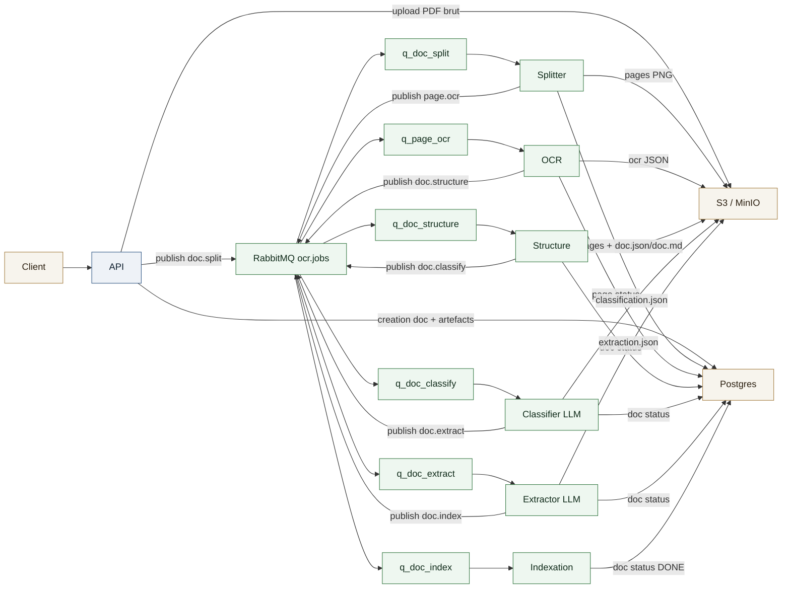
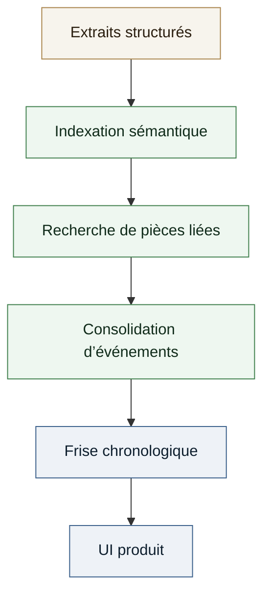

# Étude de cas - Pipeline OCR + Parsing documentaire (Tantar)

Pipeline OCR et parsing en production sur Kubernetes, orchestré par RabbitMQ, avec stockage S3 et Postgres. Le flux intègre Docling, docling-hierarchical-pdf, et une couche LLM pour classification/extraction, plus une dimension RAG pour relier les pièces et construire une frise chronologique.

## Contexte

**Poste**: Cofondateur & Lead Produit / Tech, Tantar  
**Période**: 2023 - présent  

Objectif: extraire des informations juridiques clés depuis des documents (PDF), structurer les événements, et restituer une frise chronologique fiable pour les équipes juridiques.

## Approche technique

- **Pipeline asynchrone**: workers découplés, autoscalés par la longueur de file (KEDA).
- **Parsing robuste**: OCR par page, reconstruction logique, et classification LLM par type de document.
- **Extraction structurée**: extraction LLM guidée par schémas selon le type de pièce.
- **RAG et frise chronologique**: indexation sémantique pour relier les pièces, puis génération d’une timeline structurée.
- **Fiabilité**: idempotence, retries bornés, DLQ, statuts persistés en base.

## Mon rôle

Conception de l’architecture, définition du pipeline, intégration des workers OCR/structure/classification/extraction, supervision de la qualité d’extraction et de la restitution en frise chronologique.

## Schéma du pipeline (OCR + Parsing)

## Schéma RAG + frise chronologique

## Stack technique

- **API**: FastAPI, Python.
- **Pipeline**: RabbitMQ, KEDA, Kubernetes.
- **OCR & parsing**: Tesseract, Docling, docling-hierarchical-pdf.
- **Stockage**: S3 / MinIO, Postgres.
- **LLM**: classification + extraction.
- **RAG**: indexation sémantique et rapprochement documentaire.

## Résultats

- Pipeline stable, scalable et traçable pour des documents juridiques sensibles.
- Chaîne complète du PDF brut jusqu’à la frise chronologique exploitable.
- Réduction du temps de lecture et de synthèse pour les équipes juridiques.
